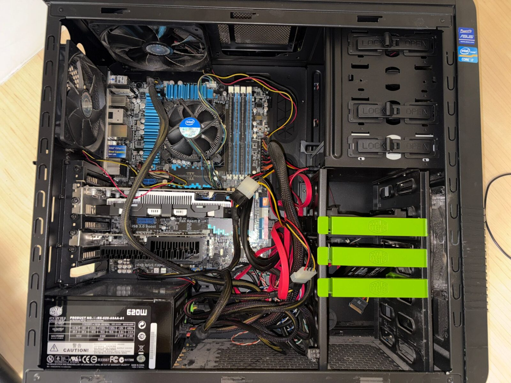
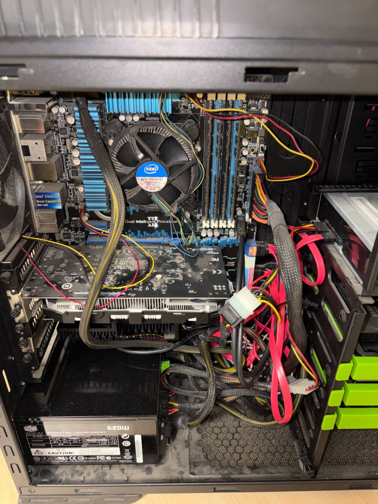
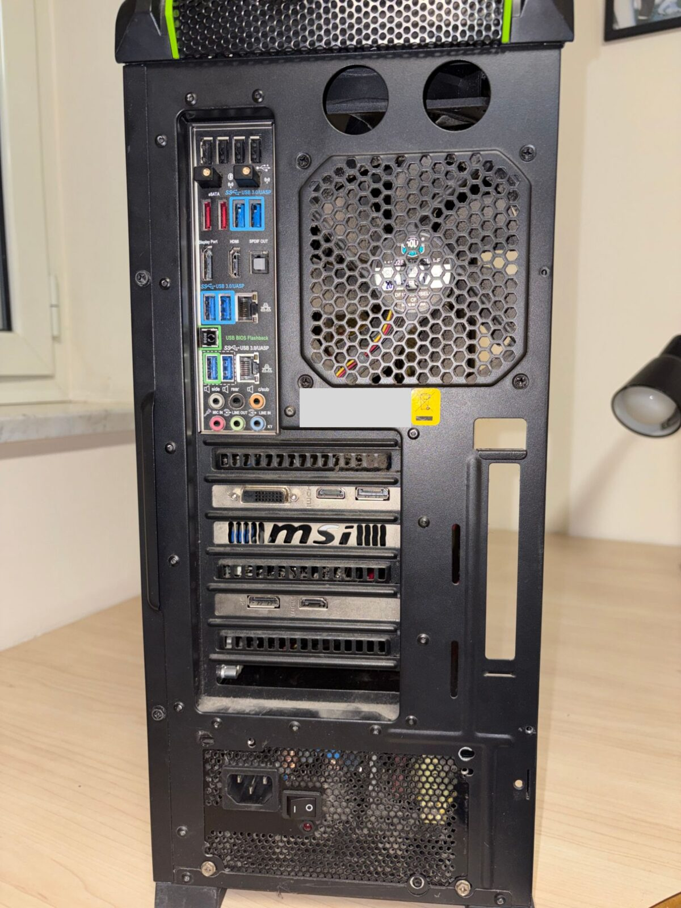

🇬🇧 [English](README.md) | 🇮🇹 Italiano

# Il mio homelab

Sono uno studente di fisica all'Università di Napoli Federico II. Voglio imparare a programmare e a gestire sistemi Linux, e capire meglio l'hardware dei PC. Vorrei anche far girare i miei servizi e tenere i miei dati a casa, invece di affidarmi ai servizi cloud. Il mio homelab è il posto dove mi esercito.

## Cosa ho adesso

| Componente | Modello |
| --- | --- |
| Scheda madre | ASUS P8Z77-V Deluxe (Z77, LGA1155) |
| CPU | Intel Core i7-3770 (4 core, 8 thread) |
| RAM | 32 GB DDR3-1600 |
| GPU | GTX 1050 Ti 4 GB + GT 1030 2 GB |
| Archiviazione | Samsung 850 EVO 250 GB + Crucial MX500 1 TB |
| Sistema | Fedora 44, in dual boot con Windows 10 |

## Foto

Il mio desktop attuale. In alto: l'interno. In basso a sinistra: scheda madre, dissipatore della CPU e GPU. In basso a destra: il retro, con le due GPU.

 

## Cosa sto costruendo

1. **Un PC principale migliore.** Il mio è del 2012 ed è già al limite: massimo 32 GB di RAM, niente NVMe, niente AVX2. Vorrei una piattaforma più recente per programmare, usare macchine virtuali e fare calcoli di fisica.
2. **Un server da laboratorio** nel mio vecchio case Cooler Master. Comincerò con Proxmox VE per imparare la virtualizzazione, poi aggiungerò TrueNAS SCALE per l'archiviazione. La sua scheda madre (ASUS P8P67 Deluxe) è rotta: il socket della CPU è danneggiato, e credo anche altre parti. Ho già un i5-2500K (da provare), 32 GB di RAM DDR3 in più (4 × 8 GB) e un Samsung 860 EVO da 250 GB per il sistema, quindi il pezzo che manca di più è una scheda madre LGA1155.
3. **Più avanti:** una rete di casa con le VLAN e un sistema di backup fatto bene, per esercitarmi come sistemista.

## Diario

- **Settembre 2026:** ho montato una seconda GPU (GT 1030) e installato Fedora 44 in dual boot con Windows 10.
- **Settembre 2026:** ho provato CUDA su tutte e due le GPU: la GTX 1050 Ti ha finito il mio test in 19,2 s, la GT 1030 in 35,7 s.
- **Settembre 2026:** acquistato usato un Samsung 860 EVO da 250 GB per il server del laboratorio. Controllo con `smartctl`: salute al 97%, circa 10 TB scritti, zero errori. Cancellazione completa con `blkdiscard`.

## L'hardware che cerco

Le cose più utili per me sono PC, workstation o mini PC funzionanti dal 2016 in poi (meglio ancora dal 2018), e gli SSD. Anche i pezzi più vecchi servono al mio laboratorio, per esempio una scheda madre LGA1155 (H77 o Z77) o hard disk. Per semplicità non mi servono router, switch, cavi, stampanti, case vuoti o laptop interi (gli SSD tolti dai laptop vanno benissimo). Posso ritirare io in tutta la Campania. Va benissimo anche la spedizione dall'Unione Europea, ma da studente non posso coprire le spese di spedizione o di dogana.

**Se siete un'azienda:** i dischi mi fanno comodo. Potete cancellarli voi prima di darmeli, oppure li cancello io davanti a voi. Se preferite tenerli, prendo volentieri i PC senza dischi. Posso anche firmare un foglio con l'elenco di quello che ricevo.

## Come uso l'hardware ricevuto

- Tutto va nel laboratorio, e lo racconto qui.
- Non rivendo l'hardware che mi regalano. Se qualcosa non serve al mio laboratorio, lo passo ad altri studenti o lo porto in un centro di raccolta.
- Tutto quello che ricevo gratis sarà elencato qui, con un grazie a chi me l'ha dato.

Tengo anche traccia di come va questo progetto, come un piccolo esperimento: quante persone e aziende rispondono, e cosa aiuta. Racconterò qui quello che imparo, senza nominare chi dice di no.

## Contatti

Se hai hardware per il mio laboratorio, o vuoi solo scrivermi: **armando [at] picardi [dot] net**. Se hai un account GitHub, puoi anche aprire una issue in questo repository.
